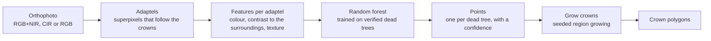

# GeoSnag

**Standing dead trees from aerial orthophotos, in QGIS: one point per tree, then the crown grown around each point.**

GeoSnag is a QGIS plugin for foresters, ecologists and anyone who has an aerial orthophoto of a forest and wants to know where the dead trees are. Load the orthophoto, run *Detect dead trees*, get a point layer with a confidence per tree. Run *Grow crowns* on the points and get the crown polygons. No tree tops, no height model, no training data and no GPU are needed. A colour-infrared or RGB+NIR orthophoto at about 0.25 m gives the best results; plain RGB works with less precision.

*A colour-infrared orthophoto of a pine stand (GUGiK, 0.25 m) and what GeoSnag makes of it: a point per standing dead tree, coloured by confidence, and the crown grown from each point.*

## Why standing dead trees

Standing dead trees (snags) are where a forest's story shows first. Bark beetle outbreaks, drought, wind and age all leave standing dead trees before anything else changes, so their number and pattern tell how a stand is doing. They are habitat for a large part of forest wildlife, a fuel and a safety concern, and an item foresters count and report. Counting them on the ground is slow; on an aerial orthophoto a bleached or grey crown among green ones is visible to anyone, and national orthophoto programmes fly most of Europe every two to three years at 0.25 m or better. GeoSnag turns that imagery into a map of dead trees, one tree at a time.

The same idea is being pursued globally: [deadtrees.earth](https://deadtrees.earth/) is an open database of centimetre-scale aerial imagery with labelled standing deadwood, built by the community for the study of tree mortality from local to global scales ([Mosig et al., 2025](https://www.sciencedirect.com/science/article/pii/S0034425725004316)). GeoSnag was built for the Polish public orthophoto archive, where every stand in the country has been photographed several times at 0.25 m, and its points and crowns can feed such databases directly.

## What it does

**Detect dead trees.** The orthophoto is split into *adaptels*, superpixels that adapt their size to the local texture, so that a dead crown is covered by a few adaptels that follow its outline; this is a superpixel step, not a segmentation of the image into objects (Achanta et al., 2018; Pawelec et al., 2026). Each adaptel is described by its colour, by how it contrasts with the canopy around it and by its texture, and a random forest trained on thousands of verified dead trees scores it. Adaptels above the threshold are merged into objects, and each object becomes one point. The confidence of every point is written next to it, so the map can be tightened or loosened afterwards without running anything again.

*A verified dead crown (dashed) and its neighbours in colour infrared, and the same 40 × 40 m in NDVI, lightness and the red-green axis of CIELAB colour. A dead crown has lost its infrared reflectance and is brighter than the canopy; the detector reads both, and so does the crown growing.*

**Grow crowns.** The points do not have to come from the detector: a layer of your own points, clicked in QGIS or surveyed in the field, grows just as well, as long as each point sits on its crown. Each point grows into the pixels around it that still look like the pixel under the point, on NDVI and lightness when the orthophoto has an infrared band and on CIELAB colour when it has not, up to a spectral tolerance and a maximum radius, while neighbouring points compete for the pixels between them. Since version 0.5 the tolerance is generous next to the point and strict at the edge, and each pixel goes to the nearest-looking point within reach, which is what makes crowns in dense bark-beetle clusters come out whole instead of being cut in half by their neighbours.

*A dense cluster of dead spruces (colour infrared, verified crowns dashed). Left: the crowns of GeoSnag 0.4. Right: the crowns of 0.5, grown on NDVI and lightness with the within-reach rule.*

## Quick start

1. Download `geosnag_plugin-<version>.zip` from the [releases page](https://github.com/igorpawelec/qgis-geosnag/releases) and install it in QGIS: *Plugins → Manage and Install Plugins → Install from ZIP*. QGIS 3.28 or newer, QGIS 4 included.
2. The first run installs the scientific Python packages the plugin needs into its own folder and downloads the models (60–145 MB per band mode). Both happen once; a machine without internet can be given a local models folder under *Advanced*.
3. *Processing Toolbox → GeoSnag → Detect dead trees*: choose the orthophoto, leave *Band mode* on auto (the log says what it read) and the threshold at 0, and run. Add stand polygons or a canopy height model if you have them; they remove roads, fields and bare ground from the result.
4. *Grow crowns* with the same orthophoto and the points. The crowns come out styled, with their area in square metres. Your own point layer works here too: mark the trees you know and let the tool draw their crowns.

Every option in both dialogs has a help text that says what changing it does; the [documentation page](docs/index.md) goes through them one by one, explains the output fields and says what to do when the result is not what you expected.

## What to expect

- With the test site never used for training, about six in ten verified dead trees are found at the default threshold, and about the same share of the points are true trees (F1 around 0.6) on RGB+NIR and colour-infrared imagery of lowland pine and spruce stands. Lowering the threshold finds more trees at the price of more false points; on imagery unlike the training flights the ranking of the points is more reliable than their absolute confidence.
- The grown crowns overlap 1 200 verified crowns from eight sites with a median IoU of 0.70 on infrared imagery (eight in ten crowns above 0.5) and 0.52 on RGB. They tend to be a little smaller than a hand-drawn outline, because thin, shaded branches at the edge fall outside the tolerance.
- The typical false points are bright bare ground, sandy forest roads, shadow edges and fresh stumps: grey, bright things with no infrared reflectance, like a dead crown. A canopy height model removes most of them (a point with nothing taller than 3 m nearby is not a tree), stand polygons remove the roads, and on RGB+NIR imagery the object score `p_object` can be cut as well.
- Trees that are dying but still carry living foliage are mostly not found; the models were trained on trees dead at the time of the flight.
- Plain RGB works, with weaker precision: a bleached crown looks much like bare ground without the infrared band, and the crowns depend more on where exactly the point sits.

*An RGB orthophoto of a spruce plot with field-verified dead trees (crosses) and GeoSnag's points and crowns from the RGB model. Most trees are found; a point on dark canopy grows into a round crown of the maximum radius, the typical RGB mistake.*

## Data, models and thanks

The models were trained on aerial orthophotos of Polish lowland forests with dead trees verified crown by crown for the author's publication (Pawelec et al., 2026) and by the State Forests' task force on dead tree monitoring:

> The study used data shared by the Task Force for Developing and Pilot Implementing a System for Monitoring and Detecting Dying and Dead Trees Using Geoinformatics Techniques in the Polish State Forests, established under Directive No. 48 of the General Director of State Forests, dated July 15, 2021. We extend special thanks to Mr. Kamil Onoszko for his invaluable support and contributions to this research.

The models are published as release assets of [pygeosnag](https://github.com/igorpawelec/pygeosnag) and downloaded on first use. The plugin bundles the three Python packages the method is made of: [pygeosnag](https://github.com/igorpawelec/pygeosnag) (detection and crowns), [pygeoadaptels](https://github.com/igorpawelec/pygeoadaptels) (adaptels and seeded region growing) and [pygeopalette](https://github.com/igorpawelec/pygeopalette) (colour spaces).

## Citing

If GeoSnag is useful in your work, please cite the method paper and the software:

> Pawelec, I., Hawryło, P., Netzel, P., & Socha, J. (2026). Evaluating superpixel algorithms for standing dead tree delineation using aerial orthoimagery. *International Journal of Applied Earth Observation and Geoinformation*, 147, 105180. https://doi.org/10.1016/j.jag.2026.105180

> Pawelec, I. (2026). GeoSnag: standing dead trees from aerial orthophotos, a QGIS plugin. https://github.com/igorpawelec/qgis-geosnag

The building blocks: adaptels follow Achanta, R., Marquez-Neila, P., Fua, P., & Süsstrunk, S. (2018), *Scale-Adaptive Superpixels*, Color and Imaging Conference (CIC26); the seeded region growing is an image foresting transform (Falcão, A. X., Stolfi, J., & Lotufo, R. A., 2004, *The image foresting transform: theory, algorithms, and applications*, IEEE Transactions on Pattern Analysis and Machine Intelligence, 26(1)); the colour conversions follow CIE 15:2004.

## Po polsku, w skrócie

GeoSnag to wtyczka QGIS, która na ortofotomapie lotniczej (najlepiej CIR lub RGB+NIR, 0,25 m, np. z Geoportalu GUGiK) znajduje stojące martwe drzewa, po jednym punkcie na drzewo z oceną pewności, a potem rozrasta z każdego punktu koronę. Nie wymaga wierzchołków, modelu wysokości ani własnych danych treningowych. Instalacja z pliku ZIP w menedżerze wtyczek; przy pierwszym uruchomieniu wtyczka sama dociąga potrzebne biblioteki i modele. Modele uczono na polskich drzewostanach sosnowych i świerkowych, z koronami zweryfikowanymi w ramach publikacji autora oraz prac Zespołu zadaniowego Lasów Państwowych ds. monitorowania drzew zamierających i martwych.

## License

GPL-3.0-or-later. Copyright Igor Pawelec, University of Agriculture in Kraków.
