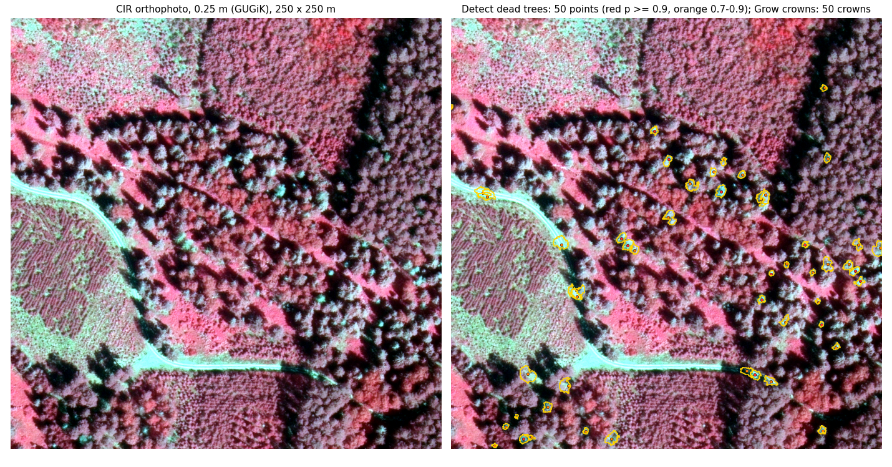
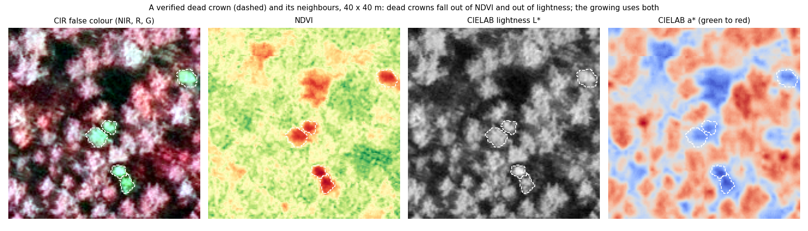
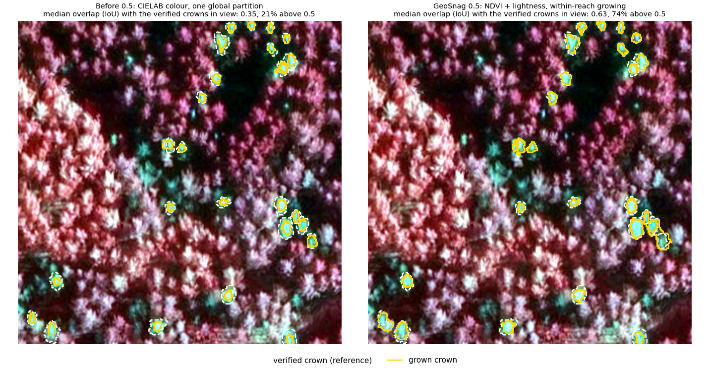
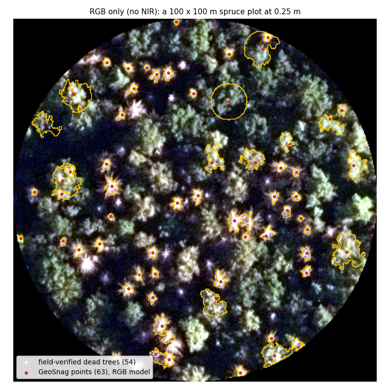

# GeoSnag: how it works and how to read it

This page is for the person running the plugin: what each tool does, what every option changes, what the output fields mean, and what to do when the result is not what you expected. The method itself is described in the paper (Pawelec et al., 2026); the numbers quoted here come from the author's own verified reference data.

- [The two tools in one picture](#the-two-tools-in-one-picture)
- [Detect dead trees](#detect-dead-trees)
- [Grow crowns](#grow-crowns)
- [Reading the results](#reading-the-results)
- [When the result is not what you expected](#when-the-result-is-not-what-you-expected)
- [Imagery](#imagery)
- [References](#references)

## The two tools in one picture

Left: a colour-infrared orthophoto (0.25 m, public GUGiK imagery) of a pine stand with scattered dead trees, which show as bright, grey-white crowns among the red living canopy. Right: *Detect dead trees* placed one point on each of them (red: confidence 0.9 and above, orange: 0.7 to 0.9) and *Grow crowns* drew the crown around every point. Nothing else was given to the tools: no tree tops, no height model, no training. A canopy height model was used here to drop points on the ground.

## Detect dead trees

### What happens inside

1. **Adaptels.** The orthophoto is split into superpixels that adapt their size to the local texture, so that a single crown is covered by a handful of adaptels following its outline, and a road or a field by a few large ones. This is a low-level, superpixel step, not a segmentation of the image into objects: the adaptels of Achanta et al. (2018), implemented in the author's [pygeoadaptels](https://github.com/igorpawelec/pygeoadaptels) package and evaluated for dead-tree delineation in Pawelec et al. (2026).
2. **Features.** Each adaptel is described by its colour (CIELAB lightness and chroma, NDVI where an infrared band exists, the green-red and blue-red ratios), by its contrast to the canopy around it, and by its texture. The colour values are standardised within the scene first, which is what lets one model read flights with different colour balances.
3. **Random forest.** A forest trained on thousands of verified dead trees scores every adaptel with a probability of being part of a dead crown. There is one forest per band mode (RGB+NIR, colour infrared, RGB).
4. **Objects and points.** Adaptels above the threshold that touch each other are merged into one object, the object becomes one point (its centroid), and the point carries the confidence of the object's best segment. Two points closer than 3 m are taken as one tree.
5. **Filters.** Optional: a canopy height model drops points with nothing taller than 3 m nearby; stand polygons drop points outside stands; on RGB+NIR imagery a second forest scores the whole object (`p_object`) and can be used as a stricter cut.

A verified dead crown (dashed) and its neighbours, 40 × 40 m, in colour infrared and in three of the values the model reads. A dead crown has lost its infrared reflectance, so it falls out of NDVI, and it is brighter than the canopy, so it stands out in lightness; on the red-green axis of CIELAB it sits with the grey ground rather than with the green canopy, which is why bright bare ground is the detector's typical mistake.

### The options

| Option | What changing it does |
|---|---|
| **Orthophoto** | The image. Four bands are read as RGB+NIR, three as colour infrared or RGB. 0.10 to 0.50 m per pixel works; the models were trained at 0.25 m. |
| **Band mode** | Which band holds what. *auto* samples the pixels and decides (four bands: RGB+NIR, or NIR first when the first band is the brightest; three bands: colour infrared when the second band is the darkest, because vegetation absorbs red, else RGB) and writes its choice in the first log line. Set it yourself when you know the order: a colour-infrared image read as RGB finds almost nothing. |
| **Probability threshold** | An adaptel is a candidate when its confidence reaches this value. Lower: more trees and more false points. Higher: fewer, cleaner points. 0 uses the value each model was calibrated with: 0.7 for RGB+NIR and colour infrared, 0.6 for RGB. On unfamiliar imagery start at 0.5 and look at the map. |
| **Stand polygons** | Forest-management polygons. Only points inside stands at least 10 years old, shrunk by 2 m, are kept; roads, fields, clear-cuts and stand edges fall out. A field named `species_age` holds the age; without it every polygon counts. |
| **Canopy height model** | A point with no pixel above 3 m within 3 m of it stands on the ground and is dropped; the height is written as `height_m`. Use a model from the same years as the imagery: a later one shows cleared stands where the dead trees stood. |
| *Advanced:* Surface and terrain model | Together they replace the canopy height model (the gate uses their difference). |
| *Advanced:* Height gate, gate radius | The height a point needs nearby (3 m) and how far to look for it (3 m, which absorbs the usual offset between an orthophoto and a height model). |
| *Advanced:* Keep the points below the gate | Checked: nothing is dropped, every point gets `height_m` and you filter later. |
| *Advanced:* Band roles | For an unusual band order: comma-separated roles in the order of the bands, e.g. `nir,red,green,blue`. |
| *Advanced:* Minimum stand age, buffer, keep outside | Stands younger than the minimum are dropped; the buffer shrinks (negative) or widens the stands before the test; *keep outside* keeps every point and only flags `in_stands`. |
| *Advanced:* Merge points closer than | Two points closer than this (3 m) are one tree; the weaker is dropped. Lower for dense young stands, higher for large old crowns that split into several objects. |
| *Advanced:* Drop points with p_object below | RGB+NIR only. A second forest scores the merged object as a whole (size, shape, contrast to the ring around it). 0.4 removes about half of the false points and a third of the true trees. For colour infrared and RGB the column stays empty. |
| *Advanced:* Scene normalisation | *auto* standardises the colour values within the scene the way the model was trained (a first pass over 16 tiles measures the scene); leave it. *off* is only right for a model trained on raw values. |
| *Advanced:* Radiometry rescue | For a hazy, dark or washed-out orthophoto on which nothing is found. *auto* stretches the scene onto the brightness range the model knows, only when it is clearly off; *match* always does. It helps on some scenes and hurts on others, so run with *off* first. |
| *Advanced:* Local models folder | A folder with `manifest.json` and the model files, for a machine without internet. Remembered between runs. |
| **Probability raster** | Optional: every pixel's confidence, to see what the model sees. Slow and large on a big orthophoto. |

## Grow crowns

### What happens inside

Each point is a seed. Starting at the pixel under it, the crown takes in neighbouring pixels that still look like that pixel, along the cheapest path (an image foresting transform, Falcão et al., 2004), up to a spectral tolerance and a maximum radius of 20 pixels (5 m at 0.25 m). Neighbouring points compete for the pixels between them, and holes inside a crown are filled.

What "looks like" means depends on the imagery. With an infrared band the crown grows on NDVI and lightness, the two values that separate a dead crown from its living neighbours and from shadow; the tolerance is 28 next to the point and falls to 12 at the maximum radius, so a crown is generous at its centre and strict at its edge, and each pixel goes to the nearest-looking point within reach. Without infrared the crown grows on CIELAB colour with the red-green axis weighted, which is what separates a grey-white crown from green canopy in plain RGB.

A dense cluster of dead spruces with the verified crowns dashed. Left: the recipe of GeoSnag 0.4 (CIELAB colour, one global partition of the image between all points, cut afterwards), where a crown loses the pixels a farther point had claimed. Right: the recipe of 0.5. On 1 200 verified crowns from eight sites the new recipe overlaps the reference with a median IoU of 0.70 and eight in ten crowns above 0.5, against 0.53 and five in ten before.

### The options

| Option | What changing it does |
|---|---|
| **Orthophoto, Dead trees** | The same orthophoto the points come from, and the points. **Your own points work too**: a layer clicked in QGIS or surveyed in the field, as long as each point sits on its crown; the tool draws the crowns and you get their areas. |
| *Advanced:* Band mode, band roles | As in *Detect dead trees*; they decide whether the crown can grow on NDVI. |
| *Advanced:* Feature space | What "looks alike" means. *auto* picks NDVI + lightness with an infrared band and weighted CIELAB colour without. The other choices are for experiments; the tolerances below are per space. |
| *Advanced:* Assignment rule | How neighbouring points share pixels. *reach*: a pixel goes to the nearest-looking point within the radius (fuller crowns in dense clusters). *partition*: one global partition first, cut afterwards (cannot grow into shadow between points; the better rule on RGB). *auto* pairs each space with the rule it was tuned with. |
| *Advanced:* Tolerance at the seed | How different from the seed pixel a pixel may be and still join. Larger: fuller crowns that may spill into shadow or ground. Smaller: tighter crowns with holes at the edge. 0 uses the space's own (28 on NDVI + lightness, 15 on CIELAB). |
| *Advanced:* Tolerance at the radius | The tolerance at the maximum radius (12 on NDVI + lightness). Lowering it stops the spill at the crown edge; raising it grows fuller edges. |
| *Advanced:* Maximum crown radius | No crown reaches farther than this from its point (20 px = 5 m at 0.25 m). Raise it for large old crowns or a finer pixel. |
| *Advanced:* Band weights | How much each value counts in the difference; empty uses the space's own. |
| *Advanced:* Fill holes | Pixels enclosed by a crown (a shaded branch, a bright spot) are added to it. |
| **Label raster** | Optional: the point index in every crown pixel, for raster-based follow-ups. |

## Reading the results

**Dead trees** (points, GeoPackage):

| Field | Meaning |
|---|---|
| `p` | Confidence of the best adaptel of the object, 0 to 1. The threshold applied to it. |
| `p_mean` | Mean confidence over the object's adaptels. |
| `p_object` | Confidence of the whole object from the second forest (RGB+NIR only; empty otherwise). |
| `area_m2`, `n_adaptels` | Size of the object and the number of adaptels in it. Very large objects are usually several trees or a bright patch of ground. |
| `height_m` | The maximum height of the height model within the gate radius (when a height model was given). |
| `in_stands` | 1 inside the stand mask, 0 outside (when stands were given and points outside kept). |
| `edge_px` | Distance to the raster edge in pixels; points at the very edge are less reliable. |

The layer comes styled by confidence: below 0.6, 0.6 to 0.75, 0.75 to 0.9, 0.9 and above.

**Crowns** (polygons, GeoPackage): one (multi)polygon per point with `adaptel_id` (the index of the point in the input layer), `area_m2`, `perimeter` and `n_parts`. A crown of several parts is a crown the tolerance split; the parts belong to the same point.

## When the result is not what you expected

- **Almost nothing was found on a colour-infrared image.** The band mode read it as RGB. Set *Band mode* to *cir*; the first log line shows what *auto* decided and why.
- **Nothing was found on a hazy, dark or washed-out orthophoto.** Try *Radiometry rescue: auto*. If it does not help, lower the threshold to 0.5 and look at the probability raster.
- **Too many points on roads, sand and bare ground.** Give a canopy height model (points on the ground fall out), stand polygons (roads fall out), or on RGB+NIR imagery cut `p_object` at 0.3 to 0.4. Raising the threshold alone helps less than these three.
- **Points on the dark canopy of a spruce stand in plain RGB.** The RGB model's weak spot. Raise the threshold, and expect the crowns of those points to come out as circles of the maximum radius (the picture below); a colour-infrared image of the same stand does much better.
- **Crowns too small.** Thin, shaded branches at the edge fall outside the tolerance by design; raise the tolerance at the radius from 12 to 15 on infrared imagery. On RGB the crowns are inherently more uncertain: moving a point by one pixel can change its crown, because the seed pixel's colour has little contrast.
- **Two dead trees came out as one point.** Lower *Merge points closer than* from 3 m to 2 m in dense young stands.
- **A large old crown came out as two points.** Raise it to 4 or 5 m.
- **Dying trees with some green left were missed.** Expected: the models were trained on trees dead at the time of the flight.

An RGB orthophoto of a spruce plot with field-verified dead trees (crosses) and the points and crowns of the RGB model. Most trees are found; the round crown of maximum radius near the top grew from a point on dark canopy, the typical RGB mistake.

## Imagery

- Best: RGB+NIR or colour infrared, leaf-on, 0.25 m, from the same flight as any height model you use. Plain RGB works with weaker precision.
- The models were trained on Polish lowland pine and spruce stands photographed by the national orthophoto programme (GUGiK) at 0.25 m. On other regions, species, cameras or decay stages the ranking of the points is usually right and the scale of the confidence is not: lower the threshold and check the map.
- A canopy height model does one thing, separate ground from trees; it says nothing about the crown. Mind its vintage.

## References

- Pawelec, I., Hawryło, P., Netzel, P., & Socha, J. (2026). Evaluating superpixel algorithms for standing dead tree delineation using aerial orthoimagery. *International Journal of Applied Earth Observation and Geoinformation*, 147, 105180. https://doi.org/10.1016/j.jag.2026.105180
- Achanta, R., Marquez-Neila, P., Fua, P., & Süsstrunk, S. (2018). Scale-Adaptive Superpixels. *Color and Imaging Conference*, CIC26.
- Falcão, A. X., Stolfi, J., & Lotufo, R. A. (2004). The image foresting transform: theory, algorithms, and applications. *IEEE Transactions on Pattern Analysis and Machine Intelligence*, 26(1), 19–29.
- Mosig, C., et al. (2025). deadtrees.earth: an open-access and interactive database for centimeter-scale aerial imagery to uncover global tree mortality dynamics. *Remote Sensing of Environment*. https://www.sciencedirect.com/science/article/pii/S0034425725004316
- CIE 15:2004. *Colorimetry*. Commission Internationale de l'Éclairage.

The models were trained on data verified for the publication above and shared by the Task Force for Developing and Pilot Implementing a System for Monitoring and Detecting Dying and Dead Trees Using Geoinformatics Techniques in the Polish State Forests (Directive No. 48 of the General Director of State Forests, 15 July 2021), with special thanks to Mr. Kamil Onoszko.
